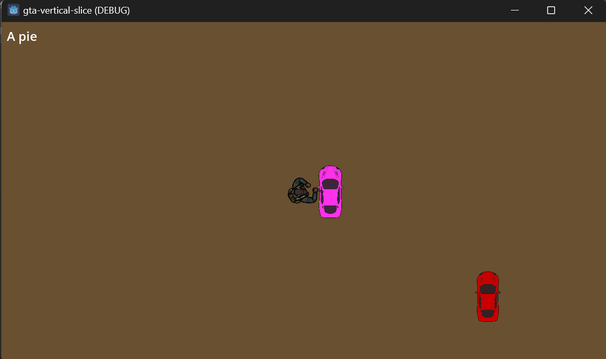

# GTA (1997) – Vertical Slice | Godot 4

> **Proyecto Académico – Ingeniería de Software (8vo Semestre)**  
> **Escuela Politécnica Nacional (EPN)**  
> **Desarrollado por:** Alejandro Alvarez




---

## 📄 Descripción del Proyecto

Este proyecto es un **Vertical Slice** que recrea las mecánicas fundamentales (**Core Loop**) del *Grand Theft Auto* original (1997) utilizando **Godot Engine 4.3**.

El objetivo principal es demostrar la implementación de una **Arquitectura de Software escalable para videojuegos**, centrada en:

* Gestión de estados complejos
* Físicas personalizadas
* Patrones de diseño desacoplados

---

## 🎮 Mecánicas Core Implementadas

* **Sistema de Car Jacking**  
  Mecánica fluida para entrar y salir de vehículos. El sistema permite *poseer* dinámicamente cualquier nodo que herede de la clase `Vehicle`, transfiriendo el control de inputs y cámara.

* **Físicas de Conducción Arcade**  
  Implementación personalizada sobre `RigidBody2D` que simula fricción lateral (*tire grip*), derrapes controlados con freno de mano y resistencia aerodinámica, evitando el comportamiento flotante por defecto.

* **Cámara Dinámica**  
  Sistema de seguimiento suavizado (`lerp`) con **Zoom Dinámico** que se aleja automáticamente según la velocidad del vehículo para aumentar el campo de visión.

* **Audio Reactivo**  
  Motor de sonido que ajusta el `pitch_scale` en tiempo real basado en la velocidad lineal del vehículo, simulando las revoluciones del motor (RPM).

* **Gestión de Límites (World Bounds)**  
  Sistema de colisiones estáticas invisibles que mantienen al jugador dentro del área de juego.

---

## 🛠️ Arquitectura Técnica

El código evita el *Spaghetti Code* mediante el uso de patrones de diseño robustos.

---

### 1. Patrón State Machine (Gestor de Jugador)

La lógica central reside en `player_state_machine.gd`.

* **Estados:**

  * `ON_FOOT` (A pie)
  * `DRIVING` (Conduciendo)

* **Desacoplamiento:**  
  Uso de señales (`state_changed`) para notificar a la cámara y la UI sin crear dependencias circulares.

* **Solución a "Physics Ejection":**  
  Algoritmo de salida segura que calcula vectores de posición global y rotación para evitar que el peatón quede atrapado (*stuck*) en las colisiones del vehículo al bajar.

---

### 2. Polimorfismo y Duck Typing

* **Clase Base:**  
  Todos los vehículos heredan de `class_name Vehicle`.

* **Validación Robusta:**  
  El sistema de entrada detecta vehículos mediante *Duck Typing* (verificando métodos como `get_current_speed`), lo que previene *crashes* si el motor pierde referencias de tipo en tiempo de ejecución.

---

### 3. Matemáticas Vectoriales

Se utiliza álgebra vectorial para calcular el agarre de las llantas en `_physics_process`:

```gdscript
# Lógica para eliminar deslizamiento lateral ("jabón")
var steering_vector = transform.y
var lateral_velocity = linear_velocity.dot(steering_vector) * steering_vector
linear_velocity -= lateral_velocity * tire_grip
```

---

## ⌨️ Controles (Input Map)

| Acción             | Tecla   | Comportamiento                                                 |
| ------------------ | ------- | -------------------------------------------------------------- |
| Moverse / Acelerar | W A S D | Movimiento relativo a la orientación del personaje o vehículo  |
| Entrar al vehículo | E       | Acercarse a la puerta del conductor                            |
| Salir del vehículo | F       | Solo permitido si el vehículo está detenido o a baja velocidad |
| Freno de mano      | ESPACIO | Reduce el `tire_grip` para permitir derrapes                   |

---

## 📂 Estructura del Proyecto

```plaintext
res://
├── assets/                 # Recursos externos
│   ├── sprites/            # Assets gráficos (Kenney Topdown)
│   └── audio/              # SFX y Música
├── scenes/
│   ├── MainGame.tscn       # Escena principal (Mundo y Límites)
│   ├── PlayerPedestrian.tscn # CharacterBody2D
│   └── PlayerVehicle.tscn  # RigidBody2D (Base para todos los autos)
├── scripts/
│   ├── player_state_machine.gd # [CORE] Gestor de estados
│   ├── dynamic_camera.gd        # [CORE] Cámara inteligente
│   ├── vehicle.gd               # [FÍSICA] Controlador de auto
│   ├── pedestrian.gd            # Controlador de peatón
│   └── hud_manager.gd           # Interfaz de usuario
```

---

## 🚀 Próximos Pasos (Roadmap)

* [x] Bloque 1: Arquitectura y State Machine
* [x] Bloque 2: Físicas de conducción (*Arcade Feel*)
* [x] Bloque 3: Integración de Audio y Visuales
* [ ] Bloque 4: Sistema de Tráfico (Pathfinding AI)
* [ ] Bloque 5: Sistema de Misiones (Pick-up & Delivery)

---

## 🎓 Créditos

* **Motor:** Godot Engine 4.3 (GDScript)
* **Programación y Diseño:** Alejandro Alvarez
* **Assets Gráficos:** Kenney (Topdown Shooter / Racing Pack)
* **Materia:** Desarrollo de Juegos Interactivos – Ingeniería de Software
